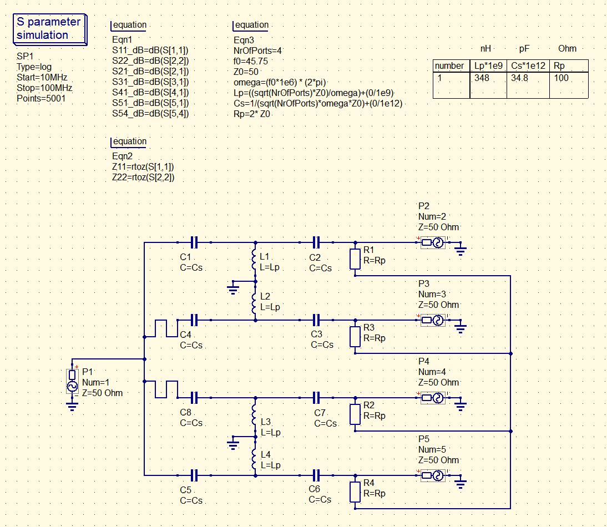
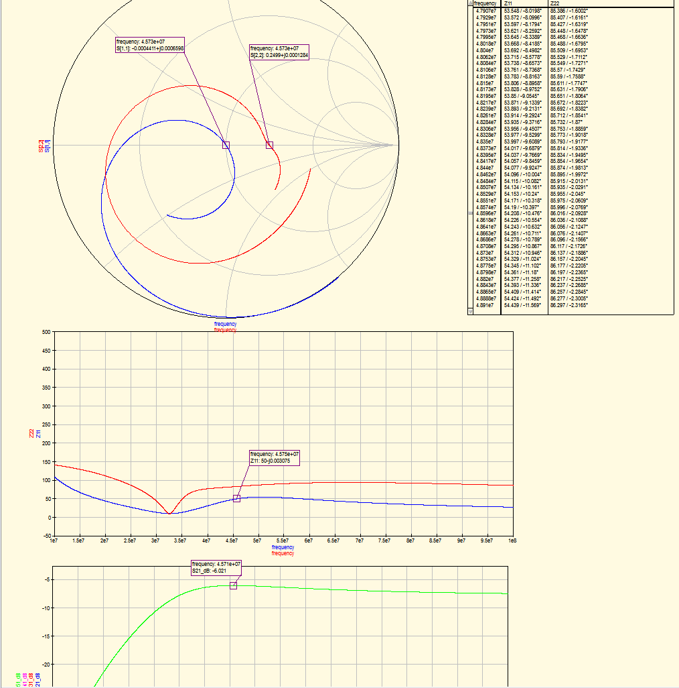
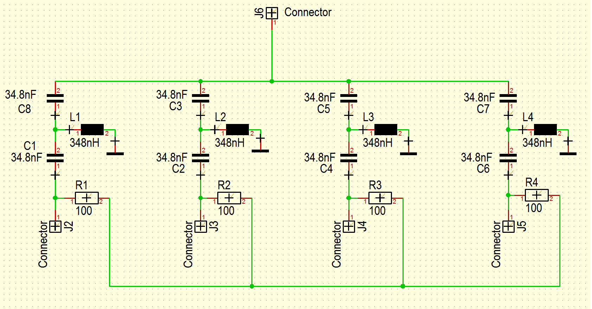

**A 4-way Wilkinson power divider made from lumped elements.**

This specific PCB was made for deuterium imaging on a 7 Tesla MRI scanner (45.75MHz), with a maximum input power of about 10kW.
The simulation contains formulas to automaticly calculate the right components for a given frequency. It can also be expanded to facilitate N-number of channels, assuming real world restrictions don't impede this process.

> Simulation made in Qucsstudio v2.5.7  
> Circuit & PCB made in Target3001 v20

**Simulation schematic**

**Simulation results**

**PCB schematic**

**PCB**

