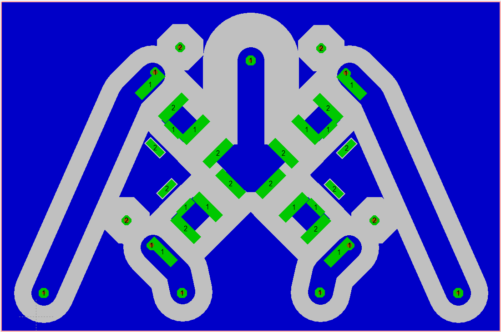

**A 4-way Wilkinson power divider made from lumped elements.**

This specific PCB was made for deuterium on 7 Tesla (45.75MHz). With a maximum input power of about 10kW.

> Simulation made in Qucsstudio v2.5.7

> Circuit & PCB made in Target3001 v20

**Simulation schematic**

**Simulation results**

**PCB schematic**

**PCB**

